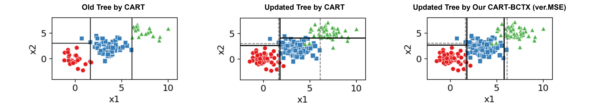

# Classification and Regression Trees with Backward Compatible Tree-based Explanations under Retraining Scenarios

Software repository for our paper: "Backward Compatibility in Tree-Based Explanations and Enhanced CART Algorithm", to appear in KDD 2026.

CART-BCTX is a natural extension of CART algorithm that supports backward compatible tree-based explanations.



## Install
```Bash
python -m pip install .
```

## Generate Docs Locally
```Bash
cd docs
make html
```

Docs is generated at `docs/_build/html/`

## Usage
The main API conforms with scikit-learn:
```Python
import numpy as np
from sklearn.datasets import load_iris
from sklearn.model_selection import train_test_split
from cartbctx import DecisionTreeClassifierBCTX

# Assume we have an "old" dataset and a "new" dataset
# (e.g. additional samples are collected after the model was deployed).
X, y = load_iris(return_X_y=True, as_frame=True)
X_old, X_tmp, y_old, y_tmp = train_test_split(X, y, train_size=0.33, random_state=0)
X_add, X_tst, y_add, y_tst = train_test_split(X_tmp, y_tmp, train_size=0.5, random_state=0)
X_new = np.concatenate([X_old, X_add], axis=0)
y_new = np.concatenate([y_old, y_add], axis=0)

# 1. Train the initial (old) tree, just like scikit-learn's DecisionTreeClassifier.
#    bctx_mode is one of 'JAC', 'JLU', 'MAE', 'MSE'; bctx_lambda controls how
#    strongly backward compatibility is enforced when retraining (step 2).
clf = DecisionTreeClassifierBCTX(bctx_mode='MSE', bctx_lambda=0.005)
clf.fit(X_old, y_old)
print("old accuracy:", clf.score(X_tst, y_tst))
dot = clf.export_graphviz(round_features=2)
dot.render('old-tree', format='png', cleanup=True)

# 2. Retrain on the new dataset (e.g. old + newly collected samples) while
#    suppressing explanation changes for backward compatibility with the
#    old tree via the BCTX regularization.
clf.update(X_new, y_new)
print("new accuracy:", clf.score(X_tst, y_tst))
dot = clf.export_graphviz(round_features=2)
dot.render('new-tree', format='png', cleanup=True)
```

For regression, use `DecisionTreeRegressorBCTX` in the same way.


## Citation
```
@InProceedings{Suzuki:KDD2026,
  title = {Backward Compatibility in Tree-Based Explanations and Enhanced CART Algorithm},
  author = {Hirofumi Suzuki},
  booktitle = {Proceedings of the 32nd ACM SIGKDD Conference on Knowledge Discovery and Data Mining V.2 (KDD 2026)},
  year = {2026},
}
```